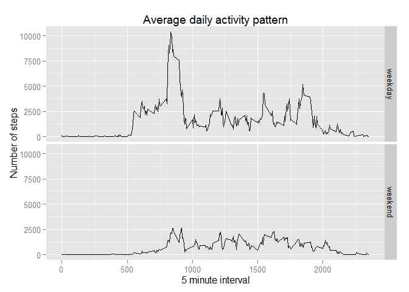

# Reproducible Research: Peer Assessment 1


## Loading and preprocessing the data


```r
library(dplyr)
```

```
## 
## Attaching package: 'dplyr'
## 
## The following objects are masked from 'package:stats':
## 
##     filter, lag
## 
## The following objects are masked from 'package:base':
## 
##     intersect, setdiff, setequal, union
```

```r
myDf <- read.csv("activity.csv")
myDf <- na.omit(tbl_df(myDf))
head(myDf)
```

```
## Source: local data frame [6 x 3]
## 
##     steps       date interval
## 289     0 2012-10-02        0
## 290     0 2012-10-02        5
## 291     0 2012-10-02       10
## 292     0 2012-10-02       15
## 293     0 2012-10-02       20
## 294     0 2012-10-02       25
```


## What is mean total number of steps taken per day?

### 1. Make a histogram of the total number of steps taken each day

* prepares the data.

```r
library(ggplot2)
stepsByDay <- 
    myDf %>%
    select(steps,date) %>%
    group_by(date) %>%
    summarise(steps = sum(steps))              

head(stepsByDay)
```

```
## Source: local data frame [6 x 2]
## 
##         date steps
## 1 2012-10-02   126
## 2 2012-10-03 11352
## 3 2012-10-04 12116
## 4 2012-10-05 13294
## 5 2012-10-06 15420
## 6 2012-10-07 11015
```


```r
qplot(steps, data = stepsByDay, fill = date)
```

```
## stat_bin: binwidth defaulted to range/30. Use 'binwidth = x' to adjust this.
```

 


### 2. Calculate and report the mean and median total number of steps taken per day.


```r
mean(stepsByDay$steps)
```

```
## [1] 10766.19
```

```r
median(stepsByDay$steps)
```

```
## [1] 10765
```

* The mean number of steps taken per day is 1.0766189\times 10^{4}

* The median number of steps taken per day is 10765


## What is the average daily activity pattern?

### 1. Make a time series plot (i.e. type = "l") of the 5-minute interval (x-axis) 
### and the average number of steps taken, averaged across all days (y-axis)

* Prepares the data

```r
stepsByInterval <- aggregate(steps~interval, data=myDf,mean)
head(stepsByInterval)
```

```
##   interval     steps
## 1        0 1.7169811
## 2        5 0.3396226
## 3       10 0.1320755
## 4       15 0.1509434
## 5       20 0.0754717
## 6       25 2.0943396
```


* Makes the plot.

```r
ga <- ggplot(data = stepsByInterval, aes(x=interval, y = steps))
ga <- ga + geom_line()
ga <- ga + xlab("5 minute interval")
ga <- ga + ylab("Average number of steps taken") 
ga <- ga + ggtitle("Average daily activity pattern")
ga
```

 

### Which 5-minute interval, on average across all the days in the dataset,
### contains the maximum number of steps?


```r
stepsByInterval[which.max(stepsByInterval$steps),]
```

```
##     interval    steps
## 104      835 206.1698
```

* The interval that contains the maximun number of steps is 835

## Imputing missing values

### 1. Calculate and report the total number of missing values in the dataset
### (i.e. the total number of rows with NAs)

* Read with missing values.

```r
myDfWithNa <- read.csv("activity.csv")
head(myDfWithNa)
```

```
##   steps       date interval
## 1    NA 2012-10-01        0
## 2    NA 2012-10-01        5
## 3    NA 2012-10-01       10
## 4    NA 2012-10-01       15
## 5    NA 2012-10-01       20
## 6    NA 2012-10-01       25
```

```r
sum(is.na(myDfWithNa))
```

```
## [1] 2304
```

* The total number of missing values is 2304

### 2. Devise a strategy for filling in all of the missing values in the dataset. The
### strategy does not need to be sophisticated. For example, you could use
### the mean/median for that day, or the mean for that 5-minute interval, etc.


```r
fillNaByInterval <- function (interval) {
    stepsByInterval[stepsByInterval$interval == interval,]$steps
}
```


### 3. Create a new dataset that is equal to the original dataset but with the
### missing data filled in.


```r
myDfFilled <- myDfWithNa

for(i in 1:nrow(myDfFilled)) {
    if(is.na(myDfFilled[i,]$steps)) {
        myDfFilled[i,]$steps <- fillNaByInterval(myDfFilled[i,]$interval)
    }
}

head(myDfFilled)
```

```
##       steps       date interval
## 1 1.7169811 2012-10-01        0
## 2 0.3396226 2012-10-01        5
## 3 0.1320755 2012-10-01       10
## 4 0.1509434 2012-10-01       15
## 5 0.0754717 2012-10-01       20
## 6 2.0943396 2012-10-01       25
```


### 4. Make a histogram of the total number of steps taken each day and Calculate
### and report the mean and median total number of steps taken per day. 


```r
library(ggplot2)

stepsByDayFilled <- 
    myDfFilled %>%
    select(steps,date) %>%
    group_by(date) %>%
    summarise(steps = sum(steps))              

head(stepsByDayFilled)
```

```
## Source: local data frame [6 x 2]
## 
##         date    steps
## 1 2012-10-01 10766.19
## 2 2012-10-02   126.00
## 3 2012-10-03 11352.00
## 4 2012-10-04 12116.00
## 5 2012-10-05 13294.00
## 6 2012-10-06 15420.00
```

### 1. Make a histogram of the total number of steps taken each day


```r
qplot(steps, data = stepsByDayFilled, fill = date)
```

```
## stat_bin: binwidth defaulted to range/30. Use 'binwidth = x' to adjust this.
```

 

* The mean number of steps taken per day is

```r
mean(stepsByDayFilled$steps)
```

```
## [1] 10766.19
```


* The median number of steps taken per day

```r
median(stepsByDayFilled$steps)
```

```
## [1] 10766.19
```


#### Do these values differ from the estimates from the first part of the assignment?
#### What is the impact of imputing missing data on the estimates of the total
#### daily number of steps?

* Is not so much different, the outpu is almost the same but with a litter diferences.


## Are there differences in activity patterns between weekdays and weekends?


### 1. Create a new factor variable in the dataset with two levels - "weekday"
### and "weekend" indicating whether a given date is a weekday or weekend
### day.

[Find the day of a week in R](http://stackoverflow.com/questions/9216138/find-the-day-of-a-week-in-r)
* For Sunday is 0 and saturday is 6.

```r
myDfFilled$day <- 
    ifelse(
        as.POSIXlt(as.Date(myDfFilled$date)
        )$wday%%6==0,"weekend","weekday")


myDfFilled$day=factor(myDfFilled$day, levels=c("weekday","weekend"))

head(myDfFilled)
```

```
##       steps       date interval     day
## 1 1.7169811 2012-10-01        0 weekday
## 2 0.3396226 2012-10-01        5 weekday
## 3 0.1320755 2012-10-01       10 weekday
## 4 0.1509434 2012-10-01       15 weekday
## 5 0.0754717 2012-10-01       20 weekday
## 6 2.0943396 2012-10-01       25 weekday
```


### 2. Make a panel plot containing a time series plot (i.e. type = "l") of the
### 5-minute interval (x-axis) and the average number of steps taken, averaged
### across all weekday days or weekend days (y-axis). The plot should look
### something like the following, which was creating using simulated data:

* Prepares the data.

```r
averagedAllWeek <- aggregate(steps~interval+day, data=myDfFilled, sum)
```

[reference facets ggplot2](http://docs.ggplot2.org/0.9.3.1/facet_grid.html)

```r
ga <- ggplot(data = averagedAllWeek, aes(x=interval, y = steps))
ga <- ga + geom_line()
ga <- ga + facet_grid(day~.)
ga <- ga + xlab("5 minute interval")
ga <- ga + ylab("Number of steps") 
ga <- ga + ggtitle("Average daily activity pattern")
ga
```

 

